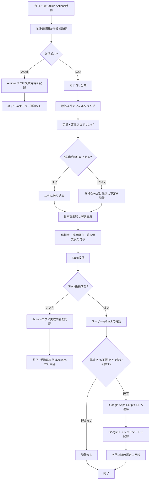

最終確認OKを受けて、ヒアリング結果を要求定義としてまとめます。章立ては、要求→要件対応表・UX方針・Mermaidフローを含む要求定義テンプレートに沿っています。

# 要求定義_AIニュースレター_20260522

## 0. 目的と背景

### 解決したい問題の定量化

現状、Zenn・Qiitaなど国内のトレンドを確認しているが、AI開発関連の情報は遅く感じることがある。情報収集に **1日15〜30分、週あたり約1.75〜3.5時間** を使っている。

この時間を減らしつつ、海外のAI開発トレンド、特に **AI開発ツール** と **AIエージェント実装Tips** を日本語で把握できる状態を作る。

### 解決方針

毎日7:00に、海外中心の情報源からAI関連ニュース候補を収集し、10件に絞ってSlackへ日本語で配信する。

初期版では以下を重視する。

* Zenn/Qiitaは対象外
* AI開発ツール：4件
* AIエージェント実装Tips：4件
* スタートアップ・新サービス：2件
* 投資・資金調達だけのニュース、一般向けAIニュース、ガジェットレビュー、ChatGPT活用術だけの記事、宣伝色が強い記事は除外
* インフルエンサーの話題性だけでは採用せず、一次情報・GitHub Star・実装例・開発者コミュニティでの反応を重視する

## 1. 想定ユーザーと利用シーン

### 対象ユーザー

個人利用。
AI開発やAIエージェント実装に関心があり、海外情報も含めて早めに把握したい開発者・プロダクト寄りの個人ユーザー。

### 主要利用シーン

毎日朝7:00にSlackへニュースレターが配信される。ユーザーは朝すぐに読んでもよいし、気になったタイミングでSlackを開いて確認する。

1件ごとに以下を見て、読むかどうかを判断する。

* タイトル
* 日本語要約3行
* なぜ注目か
* 開発者目線の使いどころ
* 元リンク
* GitHub Starなどの定量情報
* 信頼度
* 採用理由
* 読む優先度

記事を保存したい場合は、Slack内の共有リンクから手動でRaindropへ保存する。

## 2. 入出力と処理の流れ

### 入力データ

初期候補の情報源は、海外中心に幅広く設定する。

| 情報源          | 用途                  | 初期扱い          |
| ------------ | ------------------- | ------------- |
| GitHub       | Star増加・開発ツール・実装例の検出 | Must          |
| Reddit       | 開発者コミュニティでの話題検出     | Should        |
| Hacker News  | 技術者向け話題の検出          | Should        |
| Product Hunt | 新サービス・開発者向けプロダクト検出  | Could         |
| 公式ブログ・公式リリース | 一次情報確認              | Should        |
| Zenn/Qiita   | 国内既知情報              | Won't for now |

Reddit Data APIは無料対象でもレート制限があり、公式ヘルプでは OAuth client id あたり100 QPMが示されています。個人向けの日次収集であれば大きな問題にはなりにくい一方、対象subredditを増やす場合はキャッシュと取得件数制限が必要です。([Reddit Help][1])

Hacker Newsは公式APIが公開されており、技術ニュース候補の取得元として利用できます。([GitHub][2])

Product Hunt API 2.0はGraphQLインターフェースとして提供されているため、新サービス候補の取得元として使えますが、初期版では優先度を低めにします。([Product Hunt API][3])

### 出力形式

Slackの指定チャンネルまたは個人用チャンネルに、毎日7:00に1投稿として配信する。

投稿内容は以下の構成にする。

```text
本日のAI開発ニュース 10件

1. [タイトル]
カテゴリ: AI開発ツール / AIエージェント実装Tips / 新サービス
要約: 3行
なぜ注目か:
開発者目線の使いどころ:
定量情報: GitHub Star、増加傾向、投稿スコア等
信頼度: 高 / 中 / 低
採用理由:
読む優先度: 高 / 中 / 低
リンク:
フィードバック: 興味あり / 不要 / あとで読む
```

Slackへの投稿は `chat.postMessage` またはIncoming Webhookを候補にする。SlackのWeb APIはSlackワークスペース上の情報取得や投稿などに使えるインターフェースで、`chat.postMessage` はメッセージ投稿に使える公式メソッドです。([Slack API][4])

### 処理ステップ

1. GitHub Actionsが毎日7:00に起動する
2. 海外情報源から候補記事・プロジェクトを取得する
3. AI開発ツール、AIエージェント実装Tips、スタートアップ・新サービスに分類する
4. 除外条件に合うものを落とす
5. GitHub Star、開発者コミュニティ反応、一次情報、実装有用性でスコアリングする
6. 10件に絞る
7. 日本語で要約・解説する
8. 信頼度・採用理由・読む優先度を付ける
9. Slackに配信する
10. ユーザーがフィードバックボタンを押した場合、Google Apps Script経由でGoogleスプレッドシートに記録する

GitHub Actionsはスケジュール実行・手動実行に対応しており、Secretsもリポジトリ・環境・組織レベルで管理できます。これにより、SlackトークンやAPIキーをコードに直接書かずに扱えます。([GitHub Docs][5])

GitHubのStarはリポジトリへの関心レベルを示す近似指標として扱えます。ただし、GitHub Starの「急増」を厳密に見るには、日次スナップショットを保存して差分計算する必要があります。GitHubのREST APIにはレート制限があり、検索系APIには別枠の制限もあるため、取得件数とキャッシュ設計が必要です。([GitHub Docs][6])

## 3. 業務フロー Mermaid可視化



## 4. 解決したい問題→要件対応表

| 現状の解決したい問題                      | 解決する要件                                                     | 解決の判定方法                                   | 優先度 |
| ------------------------------- | ---------------------------------------------------------- | ----------------------------------------- | --- |
| 国内トレンドだけではAI開発情報が遅い             | 海外情報源を中心に毎日収集する                                            | Slack配信10件のうち海外一次情報または海外コミュニティ由来が8件以上     | M   |
| 情報収集に1日15〜30分かかる                | 毎朝7:00に10件の要約を自動配信する                                       | 手動巡回時間が1日10分以下になる                         | M   |
| 自分に合う情報源が分からない                  | 広めに取得し、フィードバックで選定傾向を調整する                                   | 興味あり率が継続的に上がる                             | M   |
| インフルエンサーや宣伝に惑わされたくない            | 採用理由・信頼度・根拠指標を表示する                                         | 各ニュースに採用理由と信頼度が必ず表示される                    | M   |
| AI開発ツールとAIエージェント実装Tipsを重点的に知りたい | 10件中8件をこの2カテゴリに割り当てる                                       | AI開発ツール4件、AIエージェントTips4件、新サービス2件の配分で配信される | M   |
| 気になる記事だけ後で読みたい                  | 元リンク・共有リンクをSlack内に表示する                                     | Raindropへの手動保存がリンクから可能                    | S   |
| フィードバックを手軽に残したい                 | Slack上のURLボタンから興味あり/不要/あとで読むを記録する                          | Googleスプレッドシートに日時・記事ID・反応が保存される           | S   |
| 導入や運用を重くしたくない                   | GitHub Actions + Google Apps Script + Google Sheets中心で構成する | 常時稼働サーバなしで日次配信できる                         | M   |

## 5. UX設計方針

### Slack配信の読みやすさ

1投稿に10件をまとめる。
各ニュースは短く、判断材料を先に出す。

1件あたりの表示は以下に固定する。

* タイトル
* カテゴリ
* 日本語要約3行
* なぜ注目か
* 開発者目線の使いどころ
* 定量情報
* 信頼度
* 採用理由
* 読む優先度
* 元リンク
* フィードバックボタン

### フィードバックUX

フィードバックは以下の3種類にする。

| ボタン   | 意味            | 次回反映                   |
| ----- | ------------- | ---------------------- |
| 興味あり  | 今後も似た情報を増やしたい | 類似カテゴリ・情報源・キーワードを加点    |
| 不要    | 今後は減らしたい      | 類似カテゴリ・情報源・キーワードを減点    |
| あとで読む | 保存候補・深掘り候補    | 優先度は高めるが、興味ありほど強く加点しない |

SlackのBlock Kitはボタンなどのインタラクティブ要素を扱えます。ただし、Slackの通常のインタラクションとして処理する場合はRequest URLが必要です。今回の初期版では常時待ち受けサーバを持たないため、正式なSlack interactionではなく、URLボタンでGoogle Apps ScriptのWebアプリURLへ遷移して記録する軽量方式にします。([Slack Developer Docs][7])

## 6. 設定方式

### 設定方法

初期版は、GitHubリポジトリのSecretsと、Googleスプレッドシート上の設定シートで管理する。

### 必須設定

| 設定項目                   | 内容                         | 管理場所                   |
| ---------------------- | -------------------------- | ---------------------- |
| Slack投稿先               | チャンネルIDまたはWebhook URL      | GitHub Secrets         |
| Slack認証情報              | Slack Bot TokenまたはWebhook  | GitHub Secrets         |
| Google Apps Script URL | フィードバック記録用URL              | GitHub Secretsまたは設定シート |
| GoogleスプレッドシートID       | フィードバック履歴保存先               | GitHub Secretsまたは設定シート |
| 対象カテゴリ                 | AI開発ツール、AIエージェントTips、新サービス | 設定シート                  |
| 除外条件                   | 宣伝色、一般向け、資金調達のみ等           | 設定シート                  |
| 配信件数                   | 10件                        | 設定シート                  |
| 配信時刻                   | 毎日7:00                     | GitHub Actions設定       |

### 機密情報管理

APIキー、Slackトークン、Webhook URLはGitHub Secretsに保存する。GitHub ActionsのSecretsはリポジトリ・環境・組織レベルで作成できるため、個人利用ではリポジトリSecretsを初期候補とする。([GitHub Docs][8])

### フィードバック保存

Google Apps ScriptをWebアプリとして公開し、URLパラメータで記事ID・フィードバック種別・日時を受け取り、Googleスプレッドシートに記録する。Apps ScriptのWebアプリは `doGet(e)` / `doPost(e)` でリクエストを受け取れるため、SlackのURLボタン遷移先として利用できます。([Google for Developers][9])

Google Apps Scriptにはサービスごとのクォータや制限があり、超過時は例外で停止する可能性があります。個人の日次ニュースレター用途では大きな負荷になりにくい想定ですが、フィードバッククリック数や取得処理が増える場合は注意が必要です。([Google for Developers][10])

## 7. 導入手順

### 初期導入

1. GitHubに専用リポジトリを作成する
2. Slack AppまたはIncoming Webhookを作成し、投稿先チャンネルを設定する
3. Googleスプレッドシートを作成し、フィードバック履歴用の列を用意する
4. Google Apps ScriptをWebアプリとして公開し、フィードバック記録URLを発行する
5. GitHub SecretsにSlack・Google Apps Script関連の値を登録する
6. GitHub Actionsの手動実行でテスト配信する
7. Slackにテストニュースが届き、フィードバックがSheetsに記録されれば初期導入完了

### 導入完了の判定

* Slackにテスト投稿が届く
* 10件のニュース形式で表示される
* 「興味あり」「不要」「あとで読む」のいずれかを押すとGoogleスプレッドシートに記録される
* GitHub Actionsの実行履歴に成功ログが残る

## 8. 運用方法

### 日常運用

ユーザーは毎朝7:00のSlack配信を見る。
気になる記事は元リンクから開く。保存したい場合は、Slackの共有リンクまたは元記事URLを使ってRaindropに手動保存する。

ニュースごとに必要に応じて以下を押す。

* 興味あり
* 不要
* あとで読む

### スケジュール

毎日7:00に自動配信する。
タイムゾーンは日本時間を前提にする。

### 監視方法

失敗時はSlackへエラー通知しない。
GitHub Actionsの実行履歴・ログで確認する。

### メンテナンス

週1回程度、Googleスプレッドシートのフィードバック履歴を確認し、以下を調整する。

* よく「不要」になる情報源
* よく「興味あり」になるカテゴリ
* Star急増しきい値
* 除外キーワード
* 新しく追加したい海外情報源

## 9. ツール・API調査結果

| ツール/API                          | 用途                          | 実現可能性 | 制約・注意点                                       |
| -------------------------------- | --------------------------- | ----- | -------------------------------------------- |
| GitHub Actions                   | 毎日7:00の自動実行、手動再実行、Secrets管理 | 高     | 常時Webhook受信には不向き                             |
| Slack Web API / Incoming Webhook | Slack配信                     | 高     | 投稿レート制限に注意。通常、同一チャンネルへの投稿は1秒あたり1メッセージ程度が目安   |
| Slack Block Kit URLボタン           | フィードバック操作                   | 中     | 通常のインタラクション処理にはRequest URLが必要。初期版はURL遷移方式で回避 |
| Google Apps Script Web App       | フィードバック記録用の軽い受け口            | 高     | クォータ超過時は停止可能性あり                              |
| Googleスプレッドシート                   | フィードバック履歴保存                 | 高     | 個人利用では十分。データ量増加時はDB移行候補                      |
| GitHub REST API                  | Star・リポジトリ情報取得              | 中〜高   | Star急増は日次スナップショット差分で算出する必要あり                 |
| Reddit Data API                  | 海外コミュニティ情報取得                | 中     | API制限・利用規約・対象subreddit選定が必要                  |
| Hacker News API                  | 技術ニュース取得                    | 高     | AI特化ではないためフィルタリング必須                          |
| Product Hunt API                 | 新サービス取得                     | 中     | GraphQL利用。新サービスは2件程度に抑える                     |
| 翻訳・要約LLM                         | 日本語要約・採用理由生成                | TBD   | 使用API、料金、品質評価、プロンプト設計は次段階で確定                 |

Slackの投稿については、Slack APIに投稿レート制限があり、一般にアプリは1チャンネルあたり毎秒1メッセージを超えない運用が求められます。今回の要件は1日1投稿なので、この制限には十分収まります。([Slack API][11])

### 技術的制約と代替案

| 制約                        | 内容                                 | 対応                               |
| ------------------------- | ---------------------------------- | -------------------------------- |
| Slackボタンの正式なinteraction処理 | Slackからのpayloadを受け取るRequest URLが必要 | 初期版はURLボタンでGoogle Apps Scriptへ遷移 |
| GitHub Actions            | 常時待ち受けサーバではない                      | 定期実行と手動実行に限定                     |
| GitHub Star急増判定           | API単体で「24時間増加数」が直接取れるとは限らない        | 毎日スナップショットを保存して差分計算              |
| 情報源の質                     | 幅広く取るとノイズが増える                      | フィードバック履歴で情報源スコアを調整              |
| 要約品質                      | LLMが誤要約する可能性                       | 元リンク、採用理由、信頼度を併記                 |
| Product Hunt              | 宣伝色が強い候補が混じりやすい                    | 新サービス枠は2件まで、宣伝色フィルタを強める          |

### 段階的実装

| フェーズ | 内容                                    | 完了条件                |
| ---- | ------------------------------------- | ------------------- |
| v0.1 | GitHub Actionsで毎日7:00にSlackへ10件配信     | Slackに日本語ニュースが届く    |
| v0.2 | Google Apps Script + Sheetsでフィードバック保存 | 興味あり/不要/あとで読むが記録される |
| v0.3 | フィードバックをランキングに反映                      | 興味あり率が改善する          |
| v0.4 | 情報源ごとの信頼度・採用理由を改善                     | 不要率が下がる             |
| v0.5 | RSS出力またはDiscord配信を追加検討                | Slack以外でも読める        |

## 10. エラー時の対応方針

| エラー                    | 対応                                             |
| ---------------------- | ---------------------------------------------- |
| 情報源取得失敗                | GitHub Actionsログに記録し、取得できた情報源だけで配信             |
| 候補が10件未満               | 候補数分だけ配信し、不足理由をログに残す                           |
| Slack投稿失敗              | GitHub Actionsを失敗扱いにしてログ確認。Slackエラー通知は不要       |
| Google Apps Script記録失敗 | ユーザーには簡易完了画面または失敗画面を表示。GitHub Actions配信自体は止めない |
| LLM要約失敗                | 元タイトル・リンク・簡易説明だけで配信、または該当件を除外                  |
| Secrets不足              | GitHub Actionsを失敗させ、ログで不足項目を確認                 |
| APIレート制限               | 取得件数を減らす、キャッシュを使う、翌日再試行する                      |
| 継続的な失敗                 | 手動でGitHub Actionsログを確認し、設定値・APIキー・Slack連携を見直す  |

## 11. TBD項目

| TBD                     | 決定者  | 期限目安       | 判断材料                                              |
| ----------------------- | ---- | ---------- | ------------------------------------------------- |
| GitHub Star急増のしきい値      | ユーザー | 初期運用1〜2週間後 | 配信されたOSSの質、ノイズ量、興味あり率                             |
| 翻訳・要約に使うLLM API         | ユーザー | 実装前        | 料金、要約品質、API制限、日本語品質                               |
| 初期情報源リスト                | ユーザー | 実装前        | Reddit subreddit候補、HN、GitHub検索条件、Product Huntカテゴリ |
| Slack投稿方式               | ユーザー | 実装前        | Bot Token方式かIncoming Webhook方式か                   |
| Google Apps Scriptの公開範囲 | ユーザー | 実装前        | 個人利用の安全性、URL漏洩時のリスク                               |
| フィードバック反映ロジック           | ユーザー | v0.3時点     | 興味あり/不要/あとで読むの蓄積データ                               |

## 12. 今回は対象外

| 対象外            | 理由                    | 再検討条件                            |
| -------------- | --------------------- | -------------------------------- |
| Zenn/Qiita収集   | 既に馴染みがあり、海外情報を優先したい   | 国内情報との比較が必要になったら                 |
| Discord配信      | 初期配信先はSlackに決定        | Slack運用が合わない場合                   |
| RSS配信          | 初期配信先はSlackに決定        | 後でRSSリーダーでも読みたくなった場合             |
| Raindrop API連携 | 手動保存で十分               | 保存操作が面倒になった場合                    |
| Slack失敗通知      | GitHub Actionsログ確認で十分 | 失敗に気づけない運用が続いた場合                 |
| 常時稼働Webアプリ     | 小さく始めたい               | Slack正式interactionや管理画面が必要になった場合 |

## 13. 成功判定

初期版の成功条件は以下。

* 毎日7:00にSlackへ配信される
* 10件中8件がAI開発ツールまたはAIエージェント実装Tipsである
* 各ニュースに要約、注目理由、使いどころ、信頼度、採用理由、リンクがある
* 投資・資金調達だけ、一般向けAIニュース、宣伝色が強い記事が明確に減っている
* 1日の情報収集時間が15〜30分から10分以下になる
* フィードバックがGoogleスプレッドシートに残る
* 1〜2週間後に「自分に合う/合わない情報源」が見えるようになる

Version: v1.0（2026-05-22）
変更要約: 初回要求定義を作成。Slack配信、GitHub Actions実行、Google Apps Script経由のフィードバック保存を初期方針として確定。

[1]: https://support.reddithelp.com/hc/en-us/articles/16160319875092-Reddit-Data-API-Wiki?utm_source=chatgpt.com "Reddit Data API Wiki"
[2]: https://github.com/hackernews/api?utm_source=chatgpt.com "HackerNews/API: Documentation and Samples for ..."
[3]: https://api.producthunt.com/v2/docs?utm_source=chatgpt.com "Product Hunt API Documentation"
[4]: https://api.slack.com/web?utm_source=chatgpt.com "Slack Web API | Slack Developer Docs"
[5]: https://docs.github.com/actions/using-workflows/events-that-trigger-workflows?utm_source=chatgpt.com "Events that trigger workflows"
[6]: https://docs.github.com/rest/activity/starring?utm_source=chatgpt.com "REST API endpoints for starring"
[7]: https://docs.slack.dev/block-kit/?utm_source=chatgpt.com "Block Kit | Slack Developer Docs"
[8]: https://docs.github.com/actions/security-guides/using-secrets-in-github-actions?utm_source=chatgpt.com "Using secrets in GitHub Actions"
[9]: https://developers.google.com/apps-script/guides/web?utm_source=chatgpt.com "Web Apps | Apps Script"
[10]: https://developers.google.com/apps-script/guides/services/quotas?utm_source=chatgpt.com "Quotas for Google Services | Apps Script"
[11]: https://api.slack.com/apis/rate-limits?utm_source=chatgpt.com "Rate limits | Slack Developer Docs"
